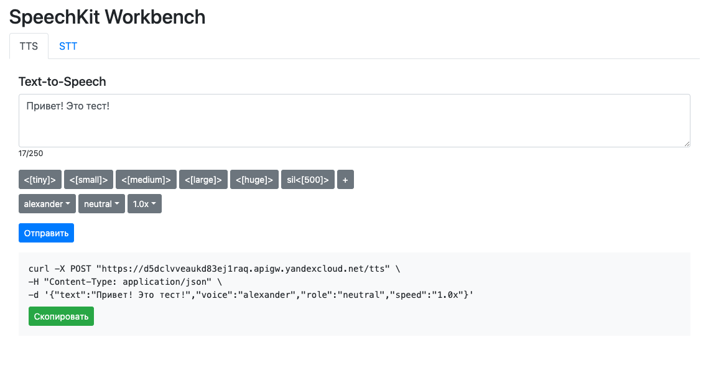
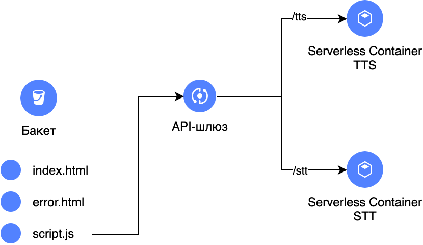

# SpeechKit Web UI



Данный репозиторий содержит пример веб-приложения, которое обращается к сервису [Yandex SpeechKit](https://cloud.yandex.com/ru/services/speechkit) и отображает его результат в веб-интерфейсе.

Приложение позволяет ознакомиться с возможностями распознавания и синтеза речи, а также с различными параметрами, доступными при синтезе речи:
- Можно выбрать и проверить различные доступные [голоса](https://cloud.yandex.com/ru/docs/speechkit/tts/voices)
- Можно использовать [TTS-разметку](https://cloud.yandex.com/ru/docs/speechkit/tts/markup/tts-markup)

Приложение состоит из следующих компонентов:
- Веб-интерфейс – статичный веб-сайт в бакете Object Storage
- Serverless Containers для обработки запросов и отправки их в сервис SpeechKit.

Результат синтеза речи сохраняется в бакет.



## Описание модуля

Данный модуль создает следующие ресурсы:

1. Бакет Object Storage
2. Объекты в бакете для работы статичного веб-сайта
2. Два контейнера Serverless Containers
3. API-шлюз
4. Сервисные учетные записи для работы контейнеров
5. Статичный ключ и API-ключ
7. Секрет в [Lockbox](https://cloud.yandex.ru/services/lockbox) для безопасного хранения ключей, используемых функцией Cloud Function

В провайдере Terraform используется аутентификация через `key.json` файл. 
При необходимости, измените аутентификацию на токен.

## Установка

Чтобы запустить данный модуль, создайте файл с переменными `private.auto.tfvars` и сохраните в него folder_id и cloud_id вашего облака и каталога в нем:
```
cloud_id  = "b1g3xxxxxx"
folder_id = "b1g7xxxxxx
```

После этого, можно установить модуль Terraform:
```
terraform init
terraform apply
```

## Использование

После установки, будут отображены следующие Outputs:

```
api-gw = "https://d5dclvvxxx.apigw.yandexcloud.net"
bucket = "https://speechbench-xxx.website.yandexcloud.net"
```

Необходимо открыть ссылку bucket в веб-браузере.
В веб-приложении есть две вкладки, соответствующие возможностям TTS и STT.
Первый запрос может занимает больше времени, так как в этот момент запускается контейнер в первый раз.

Результаты синтеза сохраняются в бакет, в директории `audio`, а последнее полученное аудио, в случае успеха, доступно для прослушивания на веб-сайте.

Аудиофайлы, отправленные на распознавание, сохраняются в директории `upload`. Результаты распознавания выводятся в веб-интерфейсе: в виде JSON ответа, и в виде просуммированного ключа `text` из JSON ответа, для каждого из аудио-каналов.

## Удаление

Перед удалением, не забудьте очистить созданный бакет (иначе процесс удаления прервется):
```
terraform destroy
```

## Связанные примеры

- [Автоматическое батч-распознавание аудио](https://github.com/yandex-cloud-examples/yc-speechkit-async-recognizer)
- [Пример стриминг распознавания](https://github.com/yandex-cloud-examples/yc-speechkit-streams-recognizer)
