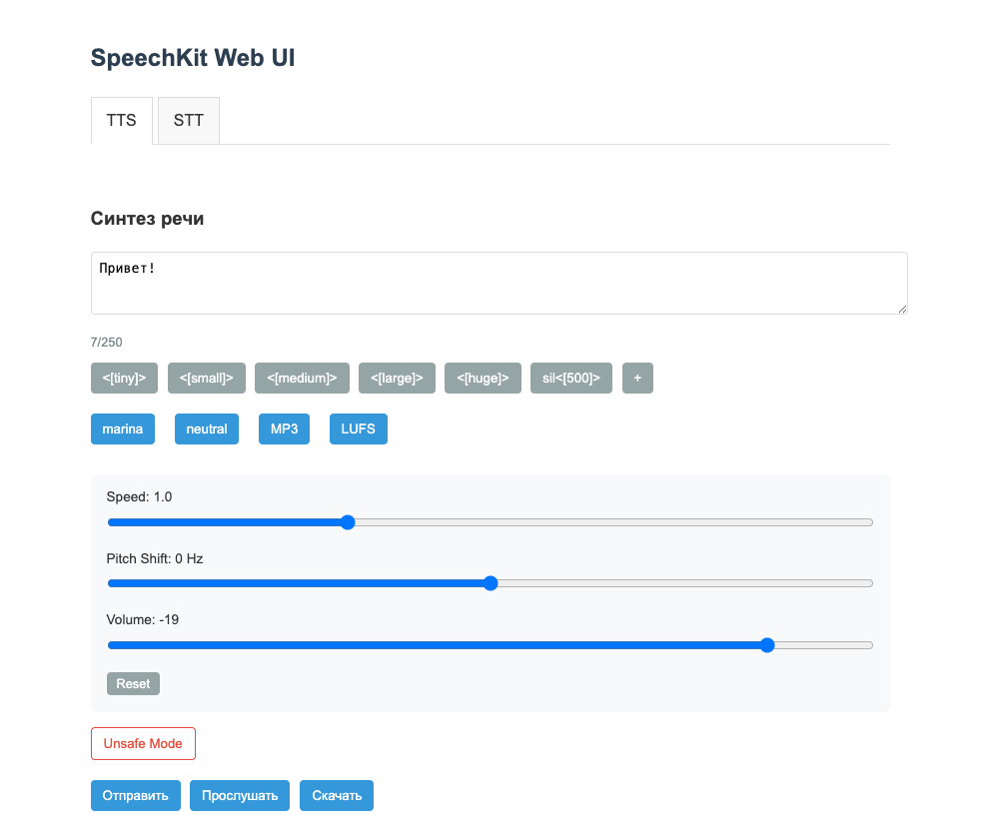

# SpeechKit Web UI

Данный репозиторий содержит пример веб-приложения, которое обращается к сервису [Yandex SpeechKit](https://cloud.yandex.com/ru/services/speechkit) и отображает его результат в веб-интерфейсе.

Приложение позволяет ознакомиться с возможностями распознавания и синтеза речи, а также с различными параметрами, доступными при синтезе речи:
- Можно выбрать и проверить различные доступные [голоса](https://cloud.yandex.com/ru/docs/speechkit/tts/voices)
- Можно использовать [TTS-разметку](https://cloud.yandex.com/ru/docs/speechkit/tts/markup/tts-markup)

Приложение состоит из следующих компонентов:
- Веб-интерфейс – статичный веб-сайт в бакете Object Storage
- Serverless Containers для обработки запросов и отправки их в сервис SpeechKit.

Результат синтеза речи сохраняется в бакет.

## Описание модуля

Данный модуль создает следующие ресурсы:

1. Бакет Object Storage
2. Объекты в бакете для работы статичного веб-сайта
2. Два контейнера Serverless Containers
3. API-шлюз
4. Сервисные учетные записи для работы контейнеров
5. Статичный ключ и API-ключ
7. Секрет в [Lockbox](https://cloud.yandex.ru/services/lockbox) для безопасного хранения ключей

В провайдере Terraform используется аутентификация через `key.json` файл. Для развертывания решения, необходима роль `admin` в каталоге, так как создаются сервисные учетные записи и выдаются роли.
При необходимости, измените аутентификацию на [токен](https://cloud.yandex.ru/ru/docs/iam/concepts/authorization/iam-token).

## Связанные примеры

- [Автоматическое батч-распознавание аудио](https://github.com/yandex-cloud-examples/yc-speechkit-async-recognizer)
- [Пример стриминг распознавания](https://github.com/yandex-cloud-examples/yc-speechkit-streams-recognizer)
