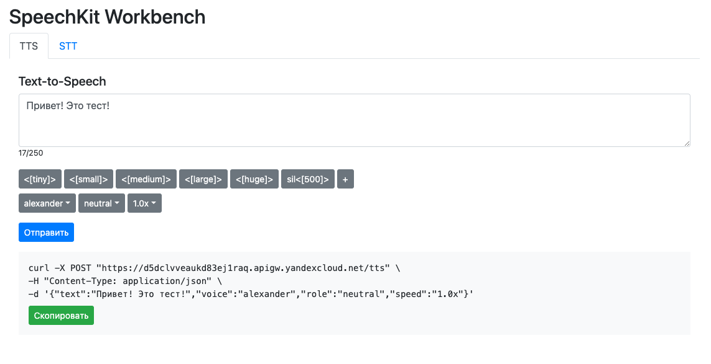

# SpeechKit Web UI



This repository contains an example web app that accesses [Yandex SpeechKit](https://yandex.cloud/en/services/speechkit) and displays its output in a web interface.

The app allows you to check out the speech recognition and synthesis features, as well as explore various parameters available for speech synthesis:
- You can select and test the available [voices](https://yandex.cloud/en/docs/speechkit/tts/voices).
- You can use the [TTS markup](https://yandex.cloud/en/docs/speechkit/tts/markup/tts-markup).

The app features the following components:
- Web interface: Static website in an Object Storage bucket.
- Serverless Containers: Required to process requests and forward them to SpeechKit.

The result of speech synthesis is stored in the bucket.


## Module description

This module creates the following resources:

1. Object Storage bucket.
2. Objects in the bucket to run a static website.
2. Two Serverless Containers.
3. API gateway.
4. Service accounts to run the containers.
5. Static key and API key.
7. [Lockbox](https://cloud.yandex.ru/services/lockbox) secret to store the keys securely.

Terraform provider employs authentication via `key.json`. To deploy this solution, you will need the `admin` role for the folder to create service accounts and assign roles.
You can change the authentication type to [token](https://yandex.cloud/en/docs/iam/concepts/authorization/iam-token), if required.

## Installation

To run this module, create a file with `private.auto.tfvars` variables and save the `folder_id` and `cloud_id` of your cloud and folder, respectively, into it:

```
cloud_id = "b1g3xxxxxx"
folder_id = "b1g7xxxxxx
```

Also, [create](https://yandex.cloud/en/docs/iam/operations/authorized-key/create) the `key.json` authorized key and save it in the folder, next to the other `.tf` files.

After that, you can install the Terraform module:

```
terraform init
terraform apply
```

## Usage

After installation, you will see the following outputs:

```
api-gw = "https://d5dclvvxxx.apigw.yandexcloud.net"
bucket = "https://speechbench-xxx.website.yandexcloud.net"
```

You need to open the bucket link in a web browser.
The web app has two tabs, for TTS and STT.
The first request may take longer because this is when the container is first started.

The synthesis results are stored in the bucket, in the `audio` directory. The last resulting audio, if successful, is available for listening on the website.

Audio files sent for recognition are saved in the `upload` directory. The recognition results are displayed in the web UI, both as a JSON response and as a summed key (`text`) from the JSON response, for each of the audio channels.

## Deletion

Before deleting, make sure to clear the created bucket (otherwise, the deletion process will abort):

```
terraform destroy
```

## Related examples

- [Automatic batch recognition of audio](https://github.com/yandex-cloud-examples/yc-speechkit-async-recognizer)
- [Streaming recognition example](https://github.com/yandex-cloud-examples/yc-speechkit-streams-recognizer)
