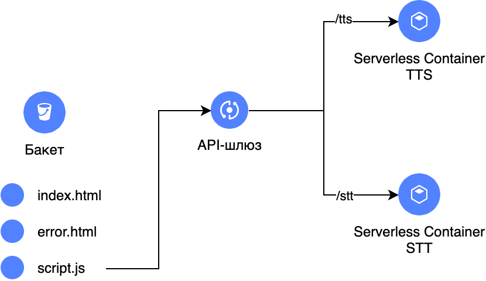

# С помощью Terraform в Yandex Cloud



## Установка

Чтобы запустить данный модуль, создайте файл с переменными `private.auto.tfvars` и сохраните в него folder_id и cloud_id вашего облака и каталога:
```
cloud_id  = "b1g3xxxxxx"
folder_id = "b1g7xxxxxx
```

Также [создайте](https://yandex.cloud/ru/docs/iam/operations/authorized-key/create) авторизованный ключ `key.json` и сохраните в папку `deploy/terraform`, рядом с другими .tf файлами.

После этого, можно установить модуль Terraform:
```
cd deploy/terraform
terraform init
terraform apply
```

## Использование

После установки, будут отображены следующие Outputs:

```
api-gw = "https://d5dclvvxxx.apigw.yandexcloud.net"
bucket = "https://speechbench-xxx.website.yandexcloud.net"
```

Необходимо открыть ссылку bucket в веб-браузере.
В веб-приложении есть две вкладки, соответствующие возможностям TTS и STT.
Первый запрос может занимает больше времени, так как в этот момент запускается контейнер в первый раз.

Результаты синтеза сохраняются в бакет, в директории `audio`, а последнее полученное аудио, в случае успеха, доступно для прослушивания на веб-сайте.

Аудиофайлы, отправленные на распознавание, сохраняются в директории `upload`. Результаты распознавания выводятся в веб-интерфейсе: в виде JSON ответа, и в виде просуммированного ключа `text` из JSON ответа, для каждого из аудио-каналов.

## Удаление

Перед удалением, не забудьте очистить созданный бакет (иначе процесс удаления прервется):
```
cd deploy/terraform
terraform destroy
```